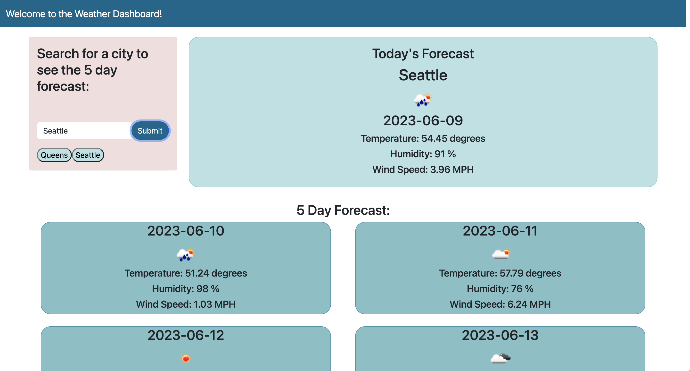

# react-weather-dashboard

## Description

This project is a web application that allows the user to search for a city name to view the current weather and 5-day forecast for that location.  It saves their previously searched city names as buttons that can be clicked to run a repeat search on those locations.  This project is a refactored version of an application I built before learning to create React applications (https://github.com/AvivaRubenstein/weather-dashboard).  Refactoring this application to use React allowed me to practice using React, and to improve the design and functionality of a past project.

## Installation

## Usage

Visit [INSERT UPDATED LINK] to open the application in the browser.  You can search the name of a city in the search bar and hit submit to see weather data for that location.  Previously searched items will be listed below the search button, and will be clickable to do a repeat search on the forecast for that location.

    

## Credits

This project uses React, Bootstrap, and the openWeather API.

## License

See LICENSE.txt in repository.
---

